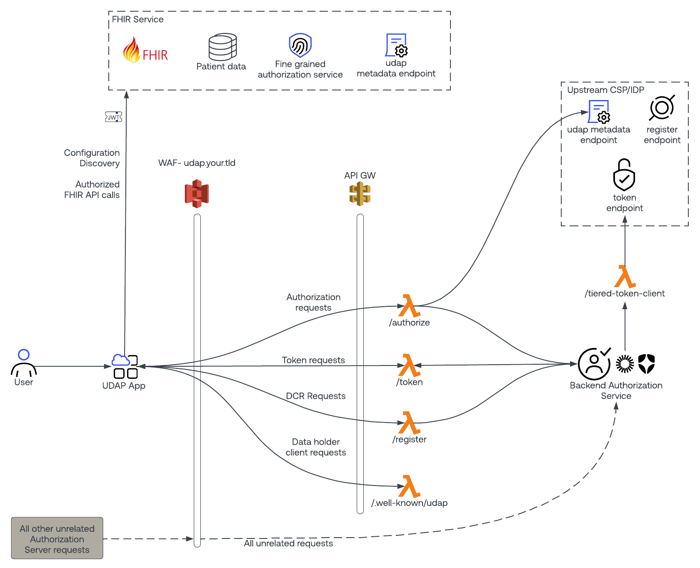

# hl7-fhir-udap-server

## Overview

This repository is intended to transform an industry standard OAuth2 authorization server (Okta and auth0 references are included) into a UDAP capable authorization server. It is part of a 4 repository collection for a full [UDAP](https://www.udap.org/) implementation including a UDAP client, a UDAP server as well as all other supporting middleware and libraries. 

This implementation adheres to the published version 1.0 of the [HL7 UDAP Security Implementation Guide](https://hl7.org/fhir/us/udap-security).   

The server side components of the following features of the IG are supported:
- [UDAP dynamic client registration](https://hl7.org/fhir/us/udap-security/registration.html)
- [B2B Authorization](https://hl7.org/fhir/us/udap-security/b2b.html)
- [B2C Authorization](https://hl7.org/fhir/us/udap-security/consumer.html)
- [Tiered OAuth](https://hl7.org/fhir/us/udap-security/user.html) serving both as data holder and/or as CSP/IDP

# Deployment Architecture


## Endpoints
This entire project is managed by the [serverless framework](https://www.serverless.com/) - which is an easy way to manage numerous cloud resources as a single unit. The codebase was developed for, and has been primarily tested with AWS technologies.
This repository includes the following high level endpoints:
- **/authorize**: This endpoint supports the tiered oauth flow as the data holder. It is responsible for performing dynamic client registration with the upstream IDP/CSP prior to passing control to the backend authorization server (Okta/auth0).

- **/register**: This endpoint will accept an inbound, UDAP compliant software statement JWT from a client. The JWT will be validated according to the UDAP specification, and then the appropriate actions will be taken within the backend authorization service (Okta/auth0).

- **/token:** This endpoint is a minimal proxy on top of the backend authorization server's /token endpoint.  It is responsible for performing PKI community validation on the inbound /token request (in addition to the industry standard private_key_jwt authentication that authorization servers already handle).

- **/tiered_token_client:** This endpoint is used when serving as a tiered-oauth data holder.  It serves as a proxy to ensure that /token requests to the upstream IDP/CSP are UDAP compliant. It leverages the [hl7-fhir-udap-client](https://github.com/Evernorth/hl7-fhir-udap-client#readme) library.

- **/.well-known/udap:** When serving as an IDP/CSP, there is a requirement to host a .well-known/udap endpoint, which can be used by clients to discover server capabilities.

## Usage

In order to deploy this solution, you must have the following pre-requisities ready to go:

- An OAuth2 authorization service to enhance:
    - Okta (a free tenant is available at [Okta's Developer Site](https://developer.okta.com/signup)).

    - auth0 (a free tenant is available at [auth0's Developer Site](https://auth0.com/signup))
- Node.js
- [serverless framework](https://www.serverless.com/) installed on the machine you're deploying from.
- An AWS tenant to deploy the solution to.
- The base URL of the FHIR service that you wish to secure.
- A domain name that you wish to use as the base URL for the authorization service (for example: udap.your.tld).

## Installation

To assist with the deployment of the overall solution, a guided deployment process has been provided. The automated process performs the following high level tasks.
* Uses a questionnaire to collect pre-requisite information from you
* Generates configuration files for automatically deploying Okta/auth0 resources as well as AWS resources
* Automatically deploying Okta/auth0 configuration
* Automatically deploying AWS configuration
* Assists with any manual steps that are necessary, such as any DNS updates that need to be made

Overall the process is managed in a step-by-step, wizard-like manner with the ability to start/stop the overall process at any point. After each step in the process, the user has the ability to continue, or pause and continue at a later time.

Files managed with the deploy script:
* deploy/work/state - This is a file created by the deploy script that determines what step in the process you're in, is used to start/stop the process, and finally is used to carry configuration information between the steps.

* /serverless.'deploymentname'.yml - This file will be generated as a copy of /deploy/aws/serverless.example.yml, with proper configuration obtained during the deployment process.  This may be used for future updates to the components deployed on AWS.

### Step 1- Install deployment dependencies
```bash
cd deploy
npm install
```

### Step 2- Run the deployment script
```bash
node deploy.js
```
Follow the guided process to finish your deployment!

### Post Deployment Management
The automated process was created with the intent of easily creating a UDAP capable authorization server. It was not intended for ongoing maintenance. For ongoing maintenance, it is recommended to use proper CI/CD pipeline processes and/or other officially released maintenance tools.

**For updates to AWS**

To make updates to AWS resources, the serverless.yaml file generated during initial deployment may be used:
```bash
serverless deploy --verbose -c serverless.'deploymentname'.yaml
```

## Getting help

If you have questions, concerns, bug reports, etc, please file an issue in this repository's Issue Tracker.

## Getting involved

Please see the [CONTRIBUTING.md](CONTRIBUTING.md) file for info on how to get involved.

## License

hl7-fhir-udap-client is Open Source Software released under the [Apache 2.0 license](https://www.apache.org/licenses/LICENSE-2.0.html).

## Original Contributors

The hl7-fhir-udap-client was developed originally as a collaborative effort between [Evernorth](https://www.evernorth.com/) and [Okta](https://www.okta.com/).  We would like to recognize the following people for their initial contributions to the project: 
 - Tom Loomis - Evernorth
 - Dan Cinnamon - Okta